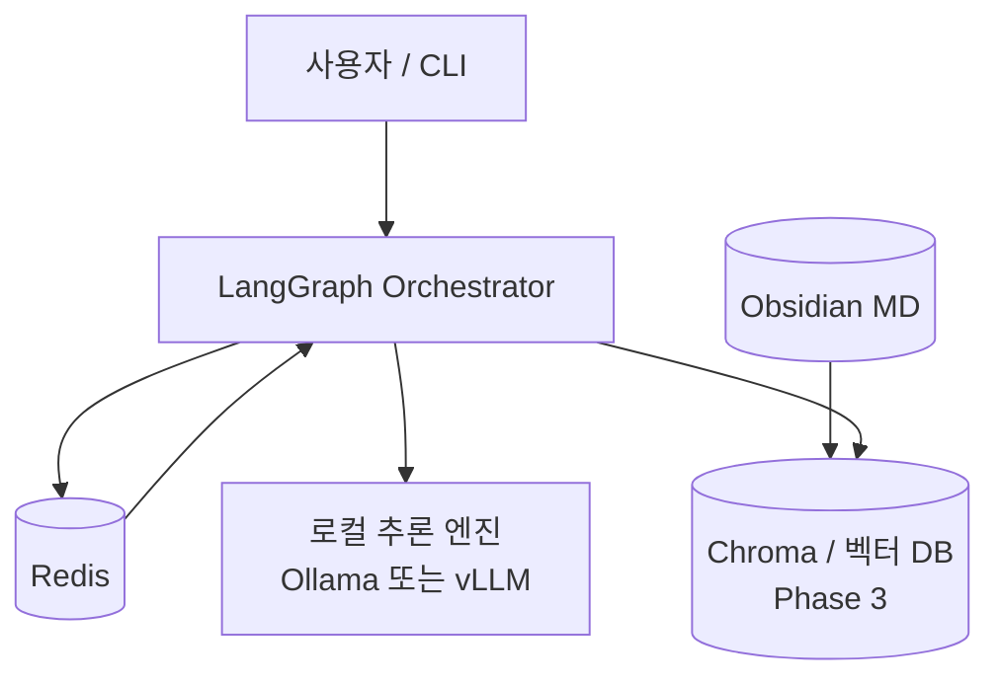
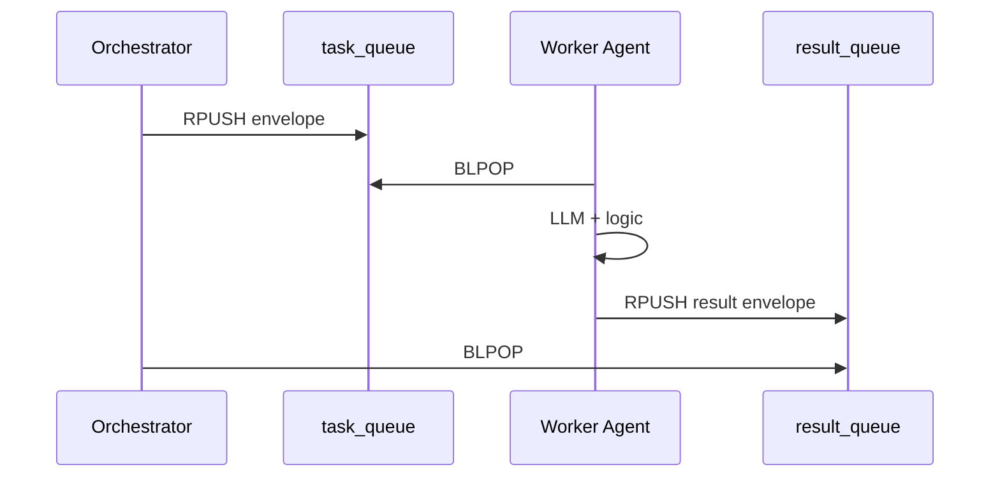
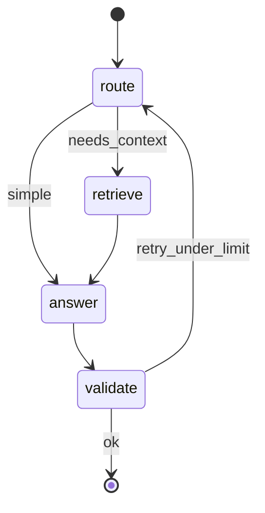

# MALA — 아키텍처 (구현 목표 기준)

초기 마스터플랜 전체가 아니라, **Phase 0~3에서 실제로 맞출 구조**만 기술합니다.  
변경 시 이 문서와 `docker-compose.yml`, `src/`를 함께 갱신합니다.

---

## 1. 컨텍스트 다이어그램



---

## 2. 4축 매핑

| 축 | 1차 구현 | Phase |
|----|----------|-------|
| **Data** | Obsidian 폴더 마운트, 헤딩 청킹, SHA-256 증분 | 3 |
| **Model** | 단일 SLLM (8B Q4 우선), API 호출 | 0~1 |
| **Agent** | LangGraph 노드 + Redis List 큐 | 2 |
| **Infra** | Native Redis (Phase 1), `.env`, optional Compose | 1 |

---

## 3. 메시지 흐름 (A2A)

에이전트는 **직접 HTTP 호출 없이** Redis 큐로만 통신합니다.



### JSON Envelope (요약)

```json
{
  "header": {
    "message_id": "uuid",
    "timestamp": "ISO8601",
    "sender": "orchestrator",
    "receiver": "worker",
    "task_id": "TASK-001"
  },
  "payload": {
    "intent": "analyze | code | route",
    "context": {},
    "instruction": "string",
    "constraints": []
  }
}
```

전체 스키마는 Phase 2에서 `src/schemas/message.py` 등으로 고정 예정.

---

## 4. LangGraph (최소 워크플로)



| 노드 | 역할 |
|------|------|
| `route` | 질의 유형 분기 (규칙 또는 소형 LLM) |
| `retrieve` | 벡터 검색 (Phase 3) |
| `answer` | 추론 엔진 호출 |
| `validate` | 형식/간단 검증, `error_count` 증가 시 종료 |

**공유 상태 (예정):**

```python
class AgentState(TypedDict):
    task_input: str
    analysis_result: str
    generated_code: str
    history: Annotated[list[str], operator.add]
    error_count: int
```

Checkpointer: 1차는 in-memory → 안정화 후 Redis.

---

## 5. 스토리지 계층 (목표)

| Tier | 기술 | 용도 |
|------|------|------|
| Hot | GPU VRAM | 모델 가중치 |
| Warm | Redis | 큐, `task_status:*` |
| Cold | SSD + Git | Obsidian, 소스, (후) DVC |

---

## 6. Phase 1 인프라 (Native Redis — ADR-002)

**기본 (BIOS Docker 불가 시):** Windows Native Redis + 호스트 Python + Ollama(호스트).

```text
e2e_once / Orchestrator  →  RPUSH task_queue
Worker (src/worker.py)   →  BRPOPLPUSH → processing → Ollama → RPUSH result_queue
```

**Optional:** [`docker-compose.yml`](../docker-compose.yml) — Redis만 (BIOS SVM 후).

```yaml
services:
  redis:
    image: redis:7-alpine
    ports: ["6379:6379"]
```

Ollama는 **호스트** `127.0.0.1:11434` — Worker가 직접 호출 ([ADR-001](decisions/001-inference-engine.md)).

---

## 7. 디렉터리 (목표)

```
src/
├── agents/          # LangGraph 노드
├── broker/          # Redis push/pop
├── schemas/         # JSON envelope
├── retrieval/       # 청킹, 인덱스 (Phase 3)
└── config.py        # env 로드

tests/
├── test_broker.py
└── test_schema.py
```

---

## 8. 장애·복구 (설계 의도)

| 시나리오 | 동작 |
|----------|------|
| Worker OOM / kill | `BRPOPLPUSH` → 메시지 `processing_queue` 잔류 → 재기동 후 처리 |
| Orchestrator 중단 | Phase 2+ Redis checkpointer로 `thread_id` 재개 (목표) |
| 인덱스 실패 | SHA-256 미변경 파일 스킵 |

---

## 9. 의도적으로 넣지 않는 것 (1차)

- 멀티 모델 동시 VRAM 상주
- FalkorDB / Cypher GraphRAG
- CrewAI, OpenHands, 무인 git

→ [`scope.md`](scope.md) 비목표와 동일

---

## 10. 변경 이력

| 날짜 | 변경 |
|------|------|
| 2026-05-22 | Phase 1 Native Redis 경로, `src/` 구조 반영 |
