# MALA — 개발 일지

**~2026-05-22** 까지: 설계·VRAM PoC·리뷰는 기존 문서 그대로 ([`design-process.md`](design-process.md), [`opinion-infra-and-career.md`](opinion-infra-and-career.md), 05-19~20 트러블슈팅).

**05-23 ~ 05-27:** 로컬 구현·검증 일지 (**V1 마감 05-27**). 스크린샷 파일명의 날짜는 **이 일지의 작업일**과 맞춤 ([`demo.md`](demo.md) — 캡처 시각과 다를 수 있음).

---

## 2026-05-23 — BIOS / Docker 막힘 → 어떻게 갈 것인가

### 상황

Phase 1은 `docker compose`로 Redis를 띄우는 그림이었는데, PC에서 **Docker Desktop**이 안 떴다.

- 메시지: *Virtualization support not detected*
- BIOS에 **설정 비밀번호**가 있어 SVM(가상화)을 켤 수 없음 → 당분간 Docker 경로는 막힘

### 고민 (선택지)

| 안 | 장점 | 단점 |
|----|------|------|
| BIOS 풀고 SVM ON | compose 그대로 | 비밀번호·리스크·당장 불가 |
| Docker 없이 Redis만 | Phase 1 목표(큐)만 달성 가능 | “문서와 다른” 인프라 |
| Memurai 등 Windows Redis | 설치 간단 | 문서·팀 합의 필요 |
| **Native Redis MSI** | ADR-001과 맞음(Ollama는 이미 호스트) | compose는 “나중에 optional” |

### 왜 Native Redis로 갔는지

1. **Phase 1 Must는 “Redis 큐 1회 왕복”**이지 Docker 자체가 아님.
2. **Ollama는 처음부터 Windows 호스트** — Worker가 `127.0.0.1:11434` 호출 ([ADR-001](decisions/001-inference-engine.md)).
3. BIOS는 나중에 풀리면 **compose는 Redis만 optional**로 두면 됨 — 전체를 다시 짜지 않아도 됨.

### 결론

- **[ADR-002](decisions/002-native-redis-phase1.md):** Phase 1 = Native Redis + 호스트 Python + 호스트 Ollama  
- Redis: [tporadowski/redis](https://github.com/tporadowski/redis/releases) 설치, `redis-cli ping` → **PONG**  
- 기록: [`troubleshooting/2026-05-20-bios-docker-blocked.md`](../troubleshooting/2026-05-20-bios-docker-blocked.md)

### 오늘 한 일 (인프라만)

- 위 결정 정리 후, 큐 코드는 **“Redis가 localhost에 있다”** 전제로 설계 시작 (`BRPOPLPUSH`, JSON Envelope)

### 증빙

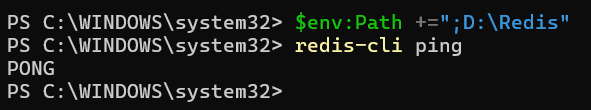

---

## 2026-05-24 — Phase 1: “메시지가 큐를 한 바퀴 도는가”

### 오늘 목표

어제 정한 경로대로 **코드 + E2E 1번**까지.

### 한 일

- `src/config.py`, `schemas/message.py`, `broker/redis_queue.py`, `worker.py`
- `scripts/check_redis.py`, `scripts/e2e_once.py`, `.env.example`, `requirements.txt`
- venv에서 `pip install`, `copy .env.example .env`
- **Worker** 한 터미널, **e2e_once** 한 터미널 → `--- E2E SUCCESS ---` (`TASK-a7525fce`, `qwen3:8b`)

### 배운 점

- 에이전트끼리 HTTP로 붙이지 않고 **Redis List + JSON Envelope**로만 통신 ([`architecture.md`](architecture.md))
- `BRPOPLPUSH`로 processing 큐에 걸린 메시지도 복구 가능하게 설계

### 증빙

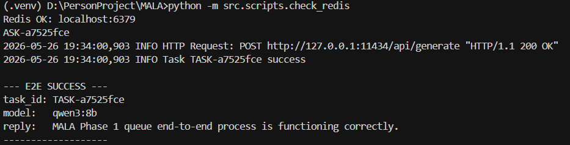

---

## 2026-05-25 — Phase 2: LangGraph + “뇌가 비어 있으면 환각한다”

### 오늘 목표

큐 위에 **오케스트레이터** 얹기. 진행 상태는 Redis Hash로 조회.

### 한 일

- `src/agents/` — `route` → `retrieve`(스텁) → `answer` → `validate` (재시도 상한)
- `task_status:{task_id}`, `run_graph_once.py`, `show_task_status.py`
- `recommend_model.py` — 3080 + 32GB면 `hybrid` 힌트 (`nvidia-smi` 폴백)
- **GRAPH SUCCESS** (`TASK-a4cdc28b`) — Worker + `run_graph_once` 2터미널

### 배운 점 (중요)

- `qwen3:8b`만 넣고 “MALA Phase 2 설명해줘” → **하이퍼파라미터 튜닝** 같은 엉뚱한 답  
  → 파이프라인은 맞는데 **지식(Context)이 비어 있음**을 확인 → Phase 3 RAG 동기 부여

### 증빙

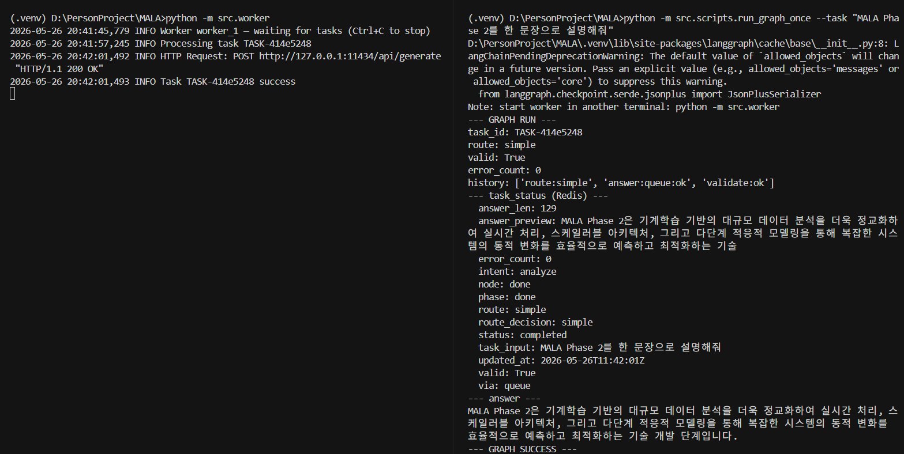  
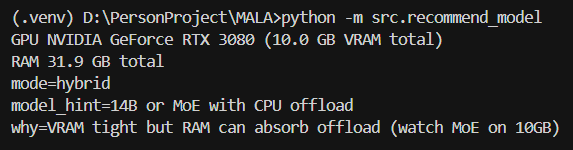

---

## 2026-05-26 — Phase 3: RAG + V1 마감 + 실제 Obsidian 볼트

### 오늘 목표

`vault_sample` RAG 검증 후, **D:\Ob\Vault** 실제 Obsidian 볼트 연동.

### 한 일 (구현)

| 구간 | 내용 |
|------|------|
| 오전 | `retrieval/` chunker, manifest, Chroma, Ollama `nomic-embed-text`, `vault_sample/`, `build_index` |
| 오후 | `retrieve` 노드 연동, `worker` 프롬프트에 context 주입, `rag_once` |
| 마감 | 검색 **rerank**(Phase-2 문서 적중), stub 문구 수정·재인덱스, **DLQ**·`verify_incremental --count 100` |

### 검증 로그

- 인덱스: `updated=1`, `skipped_unchanged=2` (3파일 중 1개만 변경)
- 100파일: **99 unchanged, 1 updated**
- RAG (샘플): **RAG SUCCESS** (`TASK-3458907b`) — `Phase-2-Agent.md` 기준
- Obsidian `D:\Ob\Vault`: `build_index` (1 note), **RAG SUCCESS** (`TASK-4860f95a`) — `환영합니다!.md`

### 증빙

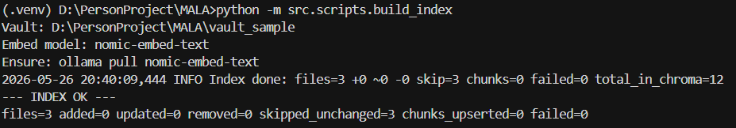  
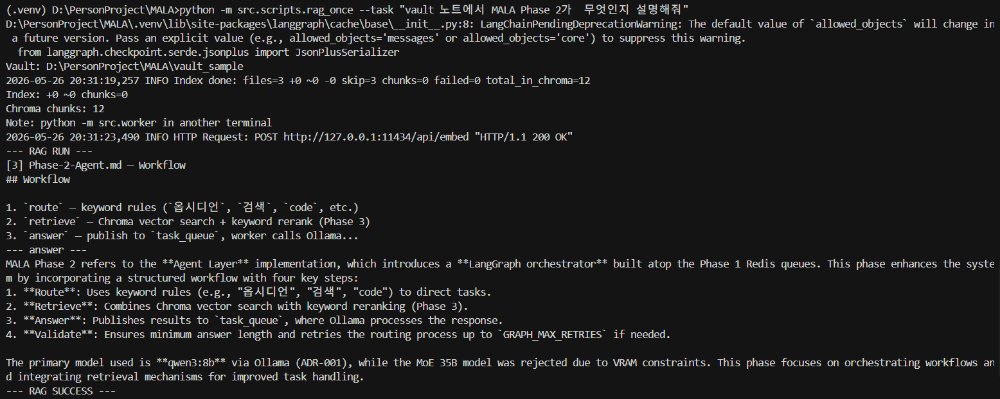  
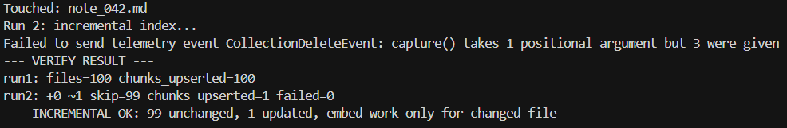  
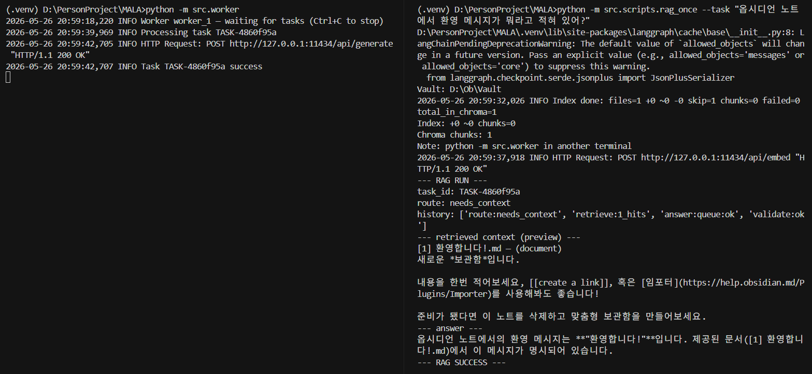 — A/B 터미널 (`TASK-4860f95a`)

### 저녁 — Ollama 모델 경로 (D:) + Phase 4 준비

**배경:** C 드라이브 여유 확보, Phase 4용 `hermes3:8b` pull.

| 구간 | 내용 |
|------|------|
| 설정 | `OLLAMA_MODELS=D:\ollama\models` (시스템 변수), 기존 `models` → D 복사 |
| 막힘 | **재부팅·Quit 후에도** `server.log`에 `OLLAMA_MODELS` = **C** 고정 |
| 원인 | Ollama **0.24** — `%LOCALAPPDATA%\Ollama\db.sqlite` `settings.models`가 C로 저장됨 (env보다 우선) |
| 조치 | DB `models` → `D:\ollama\models` 수정 · 트레이 Quit 후 재시작으로 로그 재확인 · 필요 시 C→D **junction** |

- `hermes3:8b` pull 완료 (~4.7 GB), `ollama list` 3모델
- C `models` → `models_old` 후 **`rmdir`** — `server.log`에 `OLLAMA_MODELS:D:\ollama\models` 확인
- 상세: [`troubleshooting/2026-05-26-ollama-models-path-windows.md`](../troubleshooting/2026-05-26-ollama-models-path-windows.md)

### 밤 — Phase 4: Hermes 라우터 PoC

| 구간 | 내용 |
|------|------|
| 설정 | `.env` — `USE_HERMES_ROUTER=1`, `OLLAMA_ROUTER_MODEL=hermes3:8b`, `MAX_TOOL_STEPS=5` |
| 코드 | `hermes_router.py`, `run_hermes_once.py`, `measure_router_vram.py`, `check_paths` |
| 막힘 1 | Hermes가 **`search_vault` tool 미호출** → Qwen만 답 → 환각 (`Opacity Notes` 등) |
| 조치 | **키워드 폴백** (`fallback_vault_query`) — vault형 질문이면 Chroma 검색 강제 · OOD(월드컵)는 제외 |
| 막힘 2 | Chroma **telemetry ERROR** (posthog) — RAG 무관, `chroma_store.py`에서 로그 억제 |
| VRAM | Hermes **단독** peak **7418 MiB** / 10240 · `ollama ps` **5.2 GB** — [`model-comparison.md`](model-comparison.md) |

### 검증 로그 (Phase 4)

- `check_paths` — PREFLIGHT OK, `USE_HERMES: True`
- `run_hermes_once --ood` — **OOD OK** (`TASK-9a2e30e5`), `search_vault` 없음
- `run_hermes_once` (vault) — **HERMES SUCCESS** (`TASK-6ae4de11`, `TASK-8f744eba`)
  - `route: needs_context` · `hermes:fallback_search:1_hits` · context `환영합니다!.md`
  - 답: **"환영합니다!"** (볼트와 일치)

### 증빙

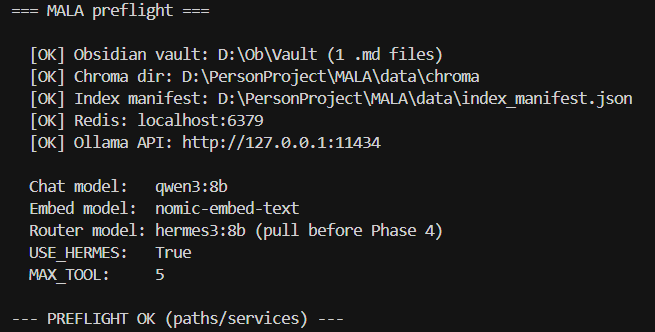  
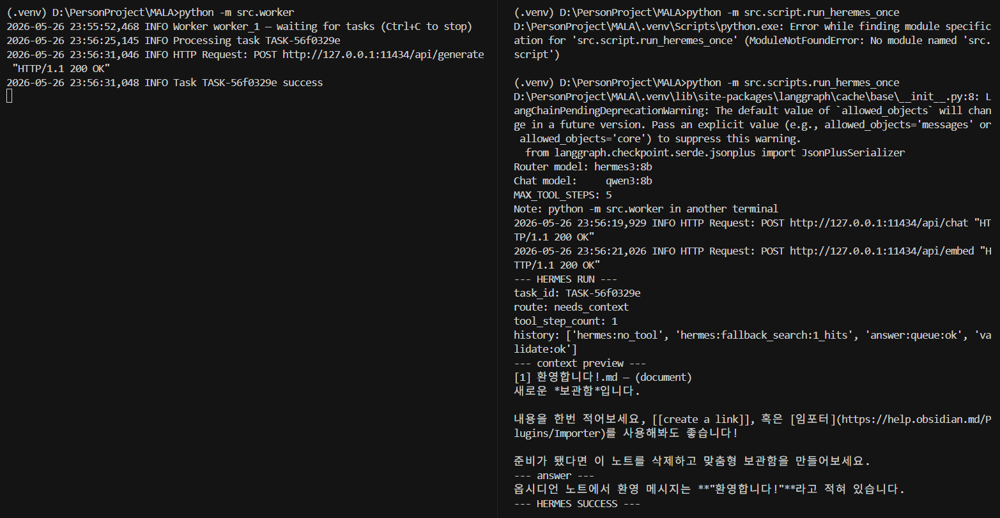 — `TASK-8f744eba`  
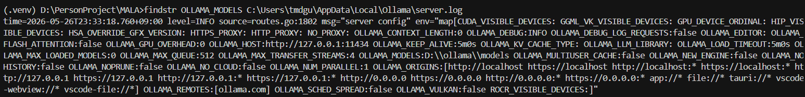

### 메모

- VRAM PoC(Qwen peak)는 **05-20** — [`assets/2026-05-20-vram-peak.png`](assets/2026-05-20-vram-peak.png)
- Phase 4 결정·PoC: [`decisions/003-phase4-hermes-router.md`](decisions/003-phase4-hermes-router.md)
- Hermes **네이티브 tool 호출**은 PoC 이후 개선 (현재 폴백으로 RAG 보장)

---

## 2026-05-27 — V1 마감 점검

### 오늘 목표

26일 PoC **동작 재확인** 후 V1 종료 — **SQLD(05-31)** 집중.

### 스모크 결과

| 항목 | 결과 |
|------|------|
| `check_paths` | PREFLIGHT OK · `USE_HERMES: True` |
| `pytest tests` | **17 passed** |
| `run_hermes_once` | **HERMES SUCCESS** (`TASK-a9198b0e`) — `fallback_search:1_hits`, `validate:ok` |
| `run_hermes_once --ood` | **OOD OK** (`TASK-9546711b`) — `hermes:no_tool`, vault 검색 없음 |

### 마감 조치

- `run_hermes_once.py` — Windows CMD(cp949) **Unicode 출력** 폴백 (`_safe_print`)
- **V1 선언** — Phase 0~4 PoC 완료 (Claude/Cursor 합의). 이후: 데모 스크립트 정리·UI는 **SQLD 이후**

### 메모

- 면접·이력서: **파이프라인 E2E 증명** · Hermes는 **폴백 RAG 그라운딩**으로 기술 (대규모 KB·완전 FC 아님)

---

## 5일 한눈에

| 날짜 | 한 줄 |
|------|--------|
| 05-23 | 인프라 막힘 **정리·결정** (BIOS → Native Redis) |
| 05-24 | Phase 1 **큐 E2E** |
| 05-25 | Phase 2 **LangGraph** + 리소스 진단 |
| 05-26 | Phase 3 **RAG** · **Ollama D:** · Phase 4 **Hermes PoC** |
| 05-27 | **V1 마감 스모크** → SQLD |

---

## task_id 모음

| 날짜 | Phase | task_id |
|------|-------|---------|
| 05-24 | 1 E2E | `TASK-a7525fce` |
| 05-25 | 2 Graph | `TASK-a4cdc28b` |
| 05-26 | 3 RAG (vault_sample) | `TASK-3458907b` |
| 05-26 | 3 RAG (Ob Vault) | `TASK-4860f95a` |
| 05-26 | 4 Hermes OOD | `TASK-9a2e30e5` |
| 05-26 | 4 Hermes vault+RAG | `TASK-8f744eba` (대표) · `TASK-6ae4de11` |
| 05-27 | 4 V1 smoke vault | `TASK-a9198b0e` |
| 05-27 | 4 V1 smoke OOD | `TASK-9546711b` |
